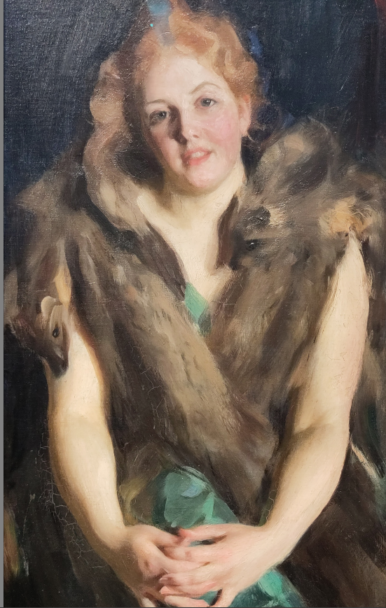

# Krita heatmap for artists

If you need to analyse the values of a picture or a painting, you can use this
heatmap inside krita.

Filters > Map > Gradient Map > XML

Considering your base picture is rather ok, not too exposed and not too much
flash.

This heatmap and the 7 values black and white gradient should be enough to get yourself started with skintones and light
analysis.

# Examples

# Inspiration

Courtesy of [Anna Wakitsch](https://www.patreon.com/annawakitsch) for providing
a grid for Photoshop, I just made it quickly myself for Krita.
